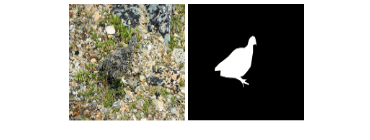

on google colab,

This code borrows heavily from [latent-diffusion-inpainting](https://github.com/nickyisadog/latent-diffusion-inpainting), thanks the contribution of [nickyisadog](https://github.com/nickyisadog)
